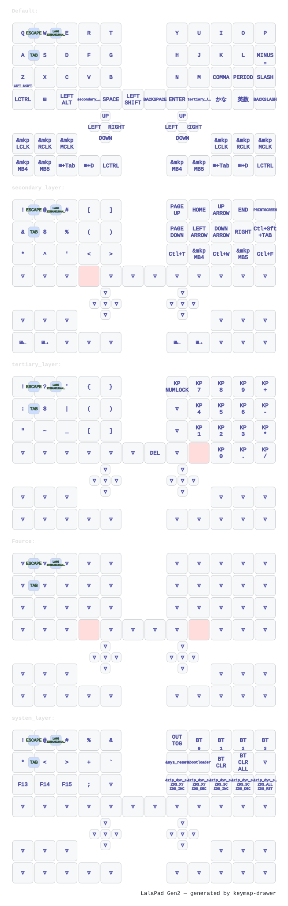

# zmk-config-LalaPadGen2

自分用 LalaPad Gen2 ZMK キーマップ設定

## キーマップ



> `config/lalapadgen2.keymap` を変更すると GitHub Actions が自動で画像を更新します。

## 日本語入力 ⇔ 英語入力の切り替え（Windows / Microsoft IME）

Default レイヤー最下段、右手側の元 `INT4` の位置に `&kp LA(GRAVE)`（Left Alt + `` ` ``、いわゆる Alt+半角バッククォート）を割り当てています。

```dts
&kp LA(GRAVE)
```

LaLaPad Gen2 公式ガイドが前提とする「Windows + Microsoft IME + 物理キーボード配列は英語(101/102)」という環境では、`Alt + `` ` ``` はMicrosoft IMEの日本語入力オン・オフの一般的な切り替え方法です。キーを押すたびに次のようにトグルします。

- タスクバー表示が `A`（IMEオフ・半角英数字直接入力）→ 押すと `あ`（IMEオン・ローマ字でひらがな入力）
- タスクバー表示が `あ`（IMEオン）→ 押すと `A`（IMEオフ）

`Win + Space` は言語／IME自体の切り替えであり、今回追加したキーとは別物です。今回のキーは「Microsoft IMEを選択した状態のまま」日本語入力のオン・オフだけを切り替えます。

### 採用しなかったキーと理由

- `LANG1` / `LANG2` : Windows上でIMEオン・オフとして動作する保証がない（`LANG1`=かな、`LANG2`=英数という挙動は主にmacOSの日本語入力の話であり、Windowsでの動作は保証されない）
- `LANG5`（半角/全角） : ZMK公式のWindows互換表で非対応。過去に本リポジトリでも試したが実機で無反応だった
- `INT4` / `INT5`（変換・無変換） : ZMK公式のWindows互換表で非対応。Microsoft IME側の「キーとタッチのカスタマイズ」設定をユーザーが手動で行わない限り、標準状態ではIMEオン・オフとして機能しない
- `F6`〜`F10` : これらはIMEオン・オフではなく、変換候補の確定前文字列に対する変換操作（ひらがな/全角カナ/半角カナ/全角英数/半角英数）。Secondaryレイヤーにこれまで通り残しています

### `INT5`（無変換キー位置）について

`INT4` の位置はIME切り替え用に置き換えましたが、`INT5` の位置は今回変更せず、そのまま残しています。

- `INT5` はZMK公式のWindows互換表では非対応キーとして扱われており、標準設定のWindowsでは無反応、または未定義の挙動になる可能性があります
- Microsoft IMEの設定「全般 → キーとタッチのカスタマイズ」で「無変換キー」の動作を明示的に「IME−オフ」などへ割り当てれば動作する場合がありますが、これはユーザー側の任意設定であり本リポジトリのデフォルトとしては前提にしていません
- 日本語入力のオン・オフは基本的に上記の `LA(GRAVE)`（元 `INT4` 位置）を使ってください
- 今回は「IME切り替え」という主目的に対して不要な変更を避けるため、`INT5` はそのまま維持しています。用途が定まり次第、別途キー割り当てを検討してください

## Windows側で必要な設定

1. Windowsの設定から「時刻と言語」→「言語と地域」で「日本語」を言語として追加する
2. 日本語の入力方式（IME）として **Microsoft IME** を使用可能にする（追加時のデフォルトでも可）
3. LaLaPad公式ガイドの推奨に従う場合、そのキーボードのハードウェアキーボードレイアウトを **英語キーボード(101/102キー)** に設定する（「言語と地域」→「日本語」→「言語のオプション」→「キーボード」→「ハードウェア キーボード レイアウト」）
4. タスクバー右下の入力インジケーターでMicrosoft IMEを選択する
5. メモ帳などを開き、`LA(GRAVE)` を割り当てたキー（元 `INT4` の位置）を押して、タスクバー表示が `A` ⇔ `あ` で切り替わることを確認する

## JIS配列キーボード（Realforceなど）を併用する場合の注意

WindowsのハードウェアキーボードレイアウトはOS全体の設定であり、USB接続した複数のキーボードごとに完全に分離できない場合があります。そのため、JIS配列のキーボード（例: Realforce）とLaLaPad Gen2を同じPCで使い分ける場合は次の点に注意してください。

- Windowsの物理キーボード配列設定は、接続している複数のキーボード間で共有されることがある
- WindowsをUS(101/102)配列にすると、JIS配列のRealforceなど別キーボードの記号入力が刻印とずれる可能性がある
- 逆にWindowsをJIS配列にした場合、`Alt + `` ` ```（`LA(GRAVE)`）ではなく、`` ` `` 単体（`GRAVE`）が半角/全角キー相当としてIME切り替えに認識される場合がある

本リポジトリのデフォルト実装は、LaLaPad Gen2公式ガイドに合わせて **US配列 + `LA(GRAVE)`** です。JIS配列環境で使う場合は、`config/lalapadgen2.keymap` のDefaultレイヤーで該当キーを次のように変更してください。

```dts
# US配列向け（デフォルト）
&kp LA(GRAVE)

# JIS配列向け
&kp GRAVE
```

## 実機での確認手順

1. ビルドした右手側用のUF2ファイル（`lalapadgen2_right`）をLaLaPad Gen2の右側に書き込む
2. Windowsで入力方式をMicrosoft IMEに切り替える
3. メモ帳を開く
4. IME表示が `A` の状態でIME切り替えキー（元 `INT4` 位置）を押す
5. 表示が `あ` になることを確認する
6. `aiueo` と入力して「あいうえお」に変換候補が出ることを確認する
7. もう一度IME切り替えキーを押す
8. 表示が `A` になることを確認する
9. `aiueo` と入力して半角英字の `aiueo` がそのまま入力されることを確認する
10. F6〜F10（Secondaryレイヤー）、レイヤー切り替え、Space、Enter、Backspaceなど他のキーに影響がないことを確認する
